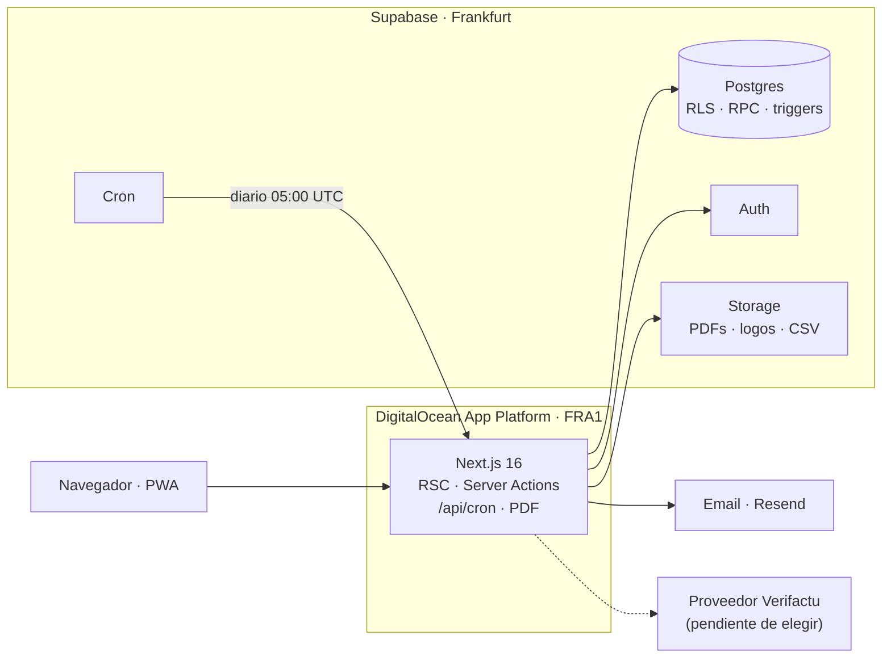
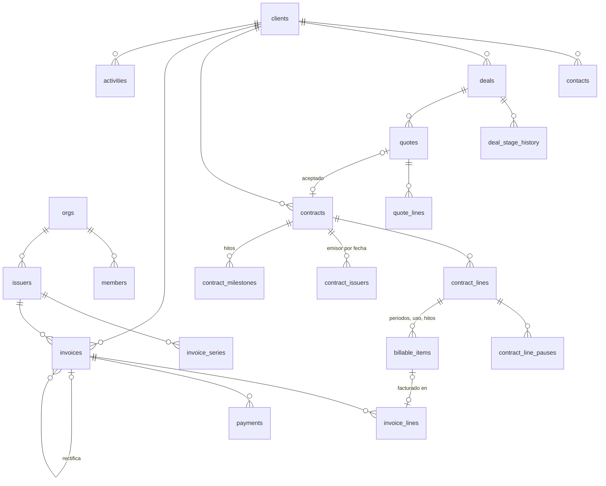
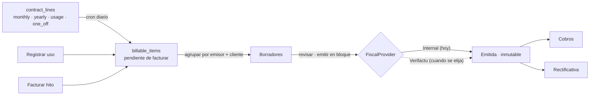

# GNERAI OS — Arquitectura

> **Estado:** v0.6 · 26/09/2026 · hitos 1.0 y 1.1 hechos; **hitos 1.2 (contratos y facturación), 1.3 (presupuestos) y 1.4 (dashboard) implementados, más el módulo de SEO adelantado de la fase 2: pendientes de vuestra validación**. El diseño del Consejo de agentes está en `CONSEJO.md`.
> **Cambios frente a la v0.1:** la app adopta la estética de gnerai.com (§9) y no se usará Holded de momento (§7.6).
> Cubre el modelo de datos, las decisiones y el plan por fases. Lo que necesito de vosotros está en el §16.

---

## 0. Resumen

- **Monolito** Next.js 16 + Supabase, desplegado en DigitalOcean App Platform (Docker). Todo en Frankfurt.
- **Estética de gnerai.com:** Manrope, fondo `#04060a`, azules de marca, botones en píldora y vidrio. La densidad, en cambio, es la de una herramienta de trabajo tipo Linear.
- **Multi-tenant desde el día 1:** `org_id` y RLS en todas las tablas, y claves foráneas compuestas `(org_id, id)` para que ningún dato pueda apuntar a otra org.
- **Dominio puro** en `src/domain/`: impuestos, recurrencias, MRR y embudo en TypeScript sin I/O, testeado con Vitest y reutilizable en una futura app móvil.
- **Regla de oro aplicada:** los estados se derivan, no se guardan (factura vencida/cobrada, estado del cliente, estado de una línea, días en etapa). Hay dos excepciones deliberadas: el documento fiscal emitido (copia legal inmutable) y la foto mensual de métricas.
- **Facturación:** líneas de contrato → cron diario → *pendiente de facturar* → borradores → emisión en bloque → factura inmutable → cobros o rectificativa.
- **Capa fiscal:** interfaz `FiscalProvider` con `InternalDraftProvider` activo (numeración y PDF propios). Sin Holded por ahora. El proveedor Verifactu se elegirá más adelante, y hasta entonces el sistema **bloquea** la emisión interna desde la fecha Verifactu de cada emisor (SL: 01/01/2027).
- **Multi-emisor con vigencia:** cada contrato sabe qué emisor factura en cada fecha. El traspaso de los autónomos a GNERAI SL es una operación con fecha, sin duplicar contratos.
- **Métricas:** MRR = monthly + yearly/12 activas. ARR = MRR × 12. El uso y el one-off van siempre aparte, también en el pipeline.
- **Dinero:** céntimos (`bigint`), tipos en puntos básicos (`2100` = 21 %), redondeo por línea documentado y testeado.
- **Plan:** fase 1 en 7 hitos validables. El último conecta el proveedor Verifactu, que la SL necesita si va a facturar desde aquí en 2027.

---

## 1. Principios

1. **Un dato, un sitio.** Si algo se puede calcular, se calcula (vista o función). Si se materializa por rendimiento, lo mantiene la base de datos (trigger) y está listado en este documento.
2. **Que se use cada día.** ⌘K para todo, atajos de teclado, nada de modales anidados, respuesta percibida por debajo de 1 s.
3. **Nada hardcodeado.** Los socios son filas de `members`. El IVA y el IRPF salen de `tax_rates` y del emisor. Las etapas, las fuentes y los motivos de pérdida son tablas. Los umbrales (7/15 días de cobro, 60/30/7 de renovación) son ajustes de la org. La marca está en `brand.ts`.
4. **Lo emitido no se toca**, y lo garantiza la base de datos, no la UI.
5. **La seguridad vive en Postgres (RLS).** Next orquesta, pero no es la única barrera. Un portal de cliente o una app móvil futuros heredan la seguridad sin reescribirla.
6. **Una regla, una implementación.** Si una regla tiene que existir en SQL (para filtrar listados) y en TypeScript (para el motor), un test de paridad las ata con los mismos casos.

---

## 2. Punto de partida: lo que ya tenéis

He revisado vuestros proyectos en `CODE_APPS/` para no rehacer lo que ya existe:

| Proyecto | Qué es | Qué se aprovecha y qué cambia |
|---|---|---|
| `gweb` (gnerai.com) | Next 16 + Tailwind 4 | Tokens de color, Manrope, formas y logos: son el sistema visual de la app (§9) |
| `facturas` (facturas-gnerai) | Generador de facturas en PDF, sin backend. La numeración vive en el `localStorage` del navegador | Su diseño es la base de la plantilla PDF, y su validación NIF/CIF con Zod se reaprovecha. Los cálculos se rehacen en céntimos. **Ojo:** el último número emitido está en el navegador de quien la usó y hay que recuperarlo antes de importar |
| `gbussinessmanager` (gnerai-finance) | App financiera previa: Supabase, magic link, cron de recurrentes y avisos por Telegram | Se reutilizan el magic link, el cron protegido con secreto y el bot de Telegram. Cambian dos cosas: allí "vencida" era un estado que un cron cambiaba cada noche y las recurrentes se copiaban de una factura plantilla; aquí "vencida" se deriva y las recurrentes nacen de contratos. La "compensación interna" entre socios pasa a la fase 2 |
| `gtiq` (TimeTrack) | Vuestra app de fichaje, también en Supabase | En la fase 2 la importación de horas puede ser directa, porque controláis los dos lados |

---

## 3. Stack

Versiones vigentes en npm a 25/09/2026. Se fijan en `package.json`.

| Pieza | Elección |
|---|---|
| App | Next.js 16.3 (App Router, RSC, Server Actions) · React 19.3 · TypeScript `strict` + `noUncheckedIndexedAccess` |
| UI | Tailwind 4.3 · shadcn/ui (Radix) · lucide-react · Manrope vía `next/font` (como la web) |
| Backend | Supabase: Postgres 17, Auth (email + magic link), Storage, Cron (pg_cron + pg_net), Vault |
| Datos | Server Components para leer y Server Actions para escribir. La UI optimista (Kanban) usa `useOptimistic` de React 19, así que TanStack Query no hace falta por ahora |
| Validación | Zod 4, con los mismos esquemas en cliente y servidor |
| Gráficas / PDF | Barras HTML accesibles para el embudo (sin librería) · Recharts 3 cuando llegue el gráfico de 24 meses (hito 1.4) · @react-pdf/renderer 4 (en Node, nunca en edge) |
| Tests | Vitest 5 · PGlite (Postgres 17 real en WASM) para RLS, triggers y RPC, sin Docker · Playwright 1.63 |

Dependencias extra, todas pequeñas:

| Paquete | Para qué | Por qué no hacerlo a mano |
|---|---|---|
| `@supabase/ssr` | Sesión en cookies con App Router | Es la oficial |
| `next-intl` | i18n es/ca/en con plurales | Se integra con RSC; hacerlo a mano sería reescribirlo |
| `@dnd-kit/core` | Drag & drop del Kanban | Accesible y usable con teclado; el DnD nativo de HTML5 no lo es |
| `cmdk` | ⌘K | Es el componente `Command` de shadcn |
| `sonner` | Toasts | El de shadcn |
| `react-hook-form` + `@hookform/resolvers` | Editores con líneas (contrato, factura, presupuesto) | Listas de campos dinámicas validadas con Zod |
| `next-themes` | Modo oscuro/claro sin parpadeo | ~1 KB |
| `tinykeys` | Atajos del tipo `g f` o `j/k` | Menos de 1 KB |
| `papaparse` | Importador CSV | Comillas, separador `;` y BOM: parsear CSV bien no es trivial |
| `write-excel-file` | XLSX para la gestoría (solo en servidor) | 1 dependencia, frente a las 9 de exceljs |
| `@electric-sql/pglite` (dev) | Tests de base de datos | Postgres real en proceso: los tests de RLS corren en local y en CI sin Docker |

**Descartado a propósito:**
- ORM: los tipos salen de `supabase gen types` y las transacciones van en funciones Postgres.
- Librerías de fechas: basta un módulo propio de fechas civiles (§7.1), con el formateo vía `Intl`.
- Sentry y analítica de producto en fase 1.

**Entorno local:** tenéis Node 22 y pnpm 11. La app corre en el puerto **3100** (el 3000 es de la web). **Falta Docker**, que necesita `supabase start` y los E2E: recomiendo Docker Desktop, gratis para empresas pequeñas. Si preferís no instalarlo, la alternativa es un proyecto Supabase de desarrollo en la nube. Los tests de base de datos no lo necesitan (PGlite).

---

## 4. Vista general



- **Lectura:** Server Component → supabase-js con el JWT del usuario → RLS.
- **Escritura:** Server Action → Zod → `src/domain` → RPC de Postgres (una transacción) → `revalidateTag`.
- **Lo que necesita secretos** (email, PDF y el futuro proveedor fiscal) vive en `src/server/`. Hoy lo llaman Server Actions; mañana lo puede llamar una ruta `/api` para la app móvil, sin reescribir nada.
- **App móvil sin bloquearla:** la seguridad está en RLS, las mutaciones críticas son RPC de Postgres invocables desde cualquier cliente, `src/domain` es TypeScript puro compartible con Expo, y la web es responsive con manifest PWA (Capacitor podría envolverla tal cual).

---

## 5. Multi-tenancy, auth y seguridad

- **Tenant = `orgs`.** Un usuario puede pertenecer a varias orgs a través de `members`. Las URLs son `/{org}/...`, como en Linear o Attio: los enlaces se pueden compartir y cada pestaña puede estar en una org distinta.
- **Roles:**
  - `owner`: todo, incluida la configuración fiscal, los miembros y las integraciones.
  - `partner`: operativa completa (emitir, cobrar, editar).
  - `viewer`: solo lectura.
- **RLS en todas las tablas de `public`.** Las funciones auxiliares son `security definer` y viven en un esquema `private` que la API no expone:
  ```sql
  private.has_role(p_org uuid, p_min member_role) returns boolean  -- viewer < partner < owner
  ```
  Leer exige `has_role(org_id, 'viewer')`, escribir `'partner'` y tocar la configuración fiscal `'owner'`. Se usa `(select auth.uid())` para que Postgres lo evalúe una sola vez por consulta.
- **FKs compuestas** `(org_id, client_id) → clients(org_id, id)`. Las FKs se saltan RLS, así que sin esto una factura de la org A podría apuntar a un cliente de la org B conociendo su UUID. Con esto la base de datos lo impide.
- **Inmutabilidad:** triggers `BEFORE UPDATE/DELETE` en `invoices` e `invoice_lines` abortan cualquier cambio en cuanto la factura deja de ser borrador. Aplican también al `service_role`.
- **Storage:** bucket privado `documents` con rutas `{org_id}/...`. La policy comprueba el primer segmento de la ruta. Las descargas usan signed URLs de vida corta.
- **Secretos de integraciones** (credenciales del futuro proveedor fiscal por emisor, tokens OAuth de Google): en Supabase Vault. Nunca en columnas planas ni en el cliente.
- **`service_role`** solo en servidor (cron y webhooks), y siempre filtrando por un `org_id` explícito.
- **Auth:** email + magic link, como en gnerai-finance, pero con invitaciones en lugar de una lista fija de emails en variables de entorno. Hace falta SMTP propio, porque el de Supabase solo permite unos pocos correos por hora y es para pruebas. Recomiendo activar MFA TOTP para los owners (Supabase lo incluye).
- **`audit_log`:** un trigger genérico en las tablas de negocio guarda quién, cuándo y el antes/después. Solo admite inserciones.

---

## 6. Modelo de datos

### 6.1 Convenciones

- **Columnas comunes:** PK `id uuid default gen_random_uuid()`. Todas las tablas llevan `org_id`, `created_at`, `updated_at` (por trigger) y `created_by default auth.uid()`.
- **Dinero:** `bigint` en céntimos, con sufijo `_cents`.
- **Tipos, descuentos y probabilidades:** `integer` en puntos básicos, con sufijo `_bps` (21 % = `2100`).
- **Cantidades:** `numeric(12,3)`.
- **Fechas civiles:** `date`, con sufijo `_on` (`issued_on`, `due_on`). Los instantes son `timestamptz`, con sufijo `_at`. "Hoy" se calcula siempre en la zona horaria de la org (`Europe/Madrid`).
- **Enums de Postgres** solo para estados de dominio estables. Los valores van en inglés y las etiquetas salen de i18n. Las listas que configura el usuario son tablas.
- **Sin borrado físico de datos maestros:** se usa `archived_at`. Solo se borran borradores.
- **Importaciones idempotentes:** `(org_id, source, external_id)` es único donde aplique, así que reimportar no duplica.

### 6.2 Diagrama (núcleo de la fase 1)



### 6.3 Tablas

**Organización y configuración**

| Tabla | Campos clave | Notas |
|---|---|---|
| `orgs` | name, slug, locale `es-ES`, timezone `Europe/Madrid`, currency `EUR`, `settings jsonb` (plazo de pago por defecto, días de recordatorio `[7,15]`, avisos de renovación `[60,30,7]`, día de facturación por defecto), `branding jsonb` | Nada de esto vive en el código |
| `members` | user_id, role, full_name, initials, color, is_active | Los 3 socios son filas, no constantes. Las iniciales (MS, MC, HL) distinguen a los dos Marc |
| `member_invitations` | email, role, token, expires_at, accepted_at | El owner invita a los demás desde el onboarding |
| `issuers` | kind `company` / `self_employed`, legal_name, trade_name, tax_id, dirección, email, iban, `default_irpf_bps` (SL 0; autónomo 1500 o 700), member_id (si es autónomo), `is_primary`, active_from, active_until, `verifactu_from`, `fiscal_provider` (hoy `internal`), `provider_config jsonb`, registry_info, logo_path | La SL se puede dar de alta antes de constituirse (`active_from` vacío). Solo un `is_primary` por org. `verifactu_from` es editable (SL 01/01/2027, autónomos 01/07/2027): la fecha ya se ha movido más de una vez. `registry_info` son los datos registrales que la SL debe imprimir en sus facturas |
| `invoice_series` | issuer_id, code, kind `ordinary` / `rectifying`, format (p. ej. `{yyyy}-{n:4}`, el que ya usáis), reset_yearly, provider_series_ref | Las rectificativas van en serie propia, como exige el art. 6.1.a del RD 1619/2012 |
| `invoice_series_counters` | series_id, year, last_number | Contador sin huecos (§7.4). Vive en `private` |
| `tax_rates` | kind `vat` / `irpf`, rate_bps, regime `general` / `exempt` / `reverse_charge_eu` / `not_subject`, legal_note, is_default | El 21 % es una fila, no una constante. `legal_note` es la mención que imprime el PDF, p. ej. "Inversión del sujeto pasivo" |
| `pipeline_stages` | name, position, kind `open` / `won` / `lost`, default_probability_bps | Semilla: Lead, Reunión, Propuesta enviada, Negociación, Ganado, Perdido, Activo |
| `acquisition_sources` | name, position | Web, SEO, Meta Ads, outreach, referido, networking… |
| `loss_reasons` | name, position | Precio, timing, competencia, sin respuesta… |

**CRM**

| Tabla | Campos clave | Notas |
|---|---|---|
| `clients` | display_name (nombre comercial), legal_name (razón social), tax_id, tax_id_kind `es` / `eu_vat` / `foreign`, dirección, country_code, sector, owner_member_id (socio responsable), is_business, preferred_language `es` / `ca` / `en`, payment_terms_days, imported_source_id, archived_at | El estado se **deriva** (§6.4). Los datos fiscales son opcionales para crear un lead y obligatorios solo al emitir. `is_business` decide si aplica IRPF. La fuente de adquisición es la del primer deal; `imported_source_id` solo existe para históricos importados sin deal |
| `contacts` | client_id, name, role, email, phone, is_primary, is_billing | Los emails viven aquí, no en `clients`. Las facturas van a los contactos con `is_billing` |
| `deals` | client_id, title, stage_id, `est_one_off_cents`, `est_mrr_cents`, probability_bps (vacío = la de la etapa), source_id, brought_by_member_id (socio que lo trajo), owner_member_id, next_action, next_action_on, loss_reason_id, loss_note, closed_on | **No hay tabla `leads`**: un lead es un deal en la etapa Lead con un cliente en estado lead. El importe va **separado** en one-off y recurrente mensual, para no mezclar tampoco en el pipeline. Un trigger exige motivo de pérdida al entrar en una etapa `lost` |
| `deal_stage_history` | deal_id, from_stage_id, to_stage_id, changed_at, changed_by | La escribe **solo un trigger** sobre `deals.stage_id`, así que es imposible olvidarla. Es la base del embudo y de los días en etapa |
| `activities` | client_id, deal_id, contact_id, kind `call` / `meeting` / `email` / `note`, title, body (markdown), occurred_at, member_id | Solo actividad humana. El timeline 360 es una **vista** que une estas filas con eventos que ya existen (facturas, cobros, cambios de etapa, contratos), así que nada se escribe dos veces |

**Presupuestos y contratos**

| Tabla | Campos clave | Notas |
|---|---|---|
| `quotes` | client_id, deal_id, issuer_id, number, status `draft` / `sent` / `accepted` / `rejected`, issued_on, valid_until, language, payment_plan (p. ej. 50/50), notes | "Caducado" se deriva de `valid_until`. Al aceptarse queda congelado |
| `quote_lines` | Igual que `contract_lines` | El PDF puede decir "1.500 € de alta + 350 €/mes" sin mezclar conceptos |
| `contracts` | client_id, deal_id, quote_id, title, signed_on, payment_terms_days, payment_method, invoice_grouping `client` / `contract`, notes | El estado se deriva de sus líneas. Solo se factura si tiene `signed_on`. El PDF firmado va a `attachments` |
| `contract_issuers` | contract_id, issuer_id, valid_from, transfer_id | Qué emisor factura el contrato **en cada fecha**. El traspaso a la SL consiste en insertar filas (§7.7) |
| `issuer_transfers` | from_issuer_id, to_issuer_id, effective_on, executed_at, notes | Agrupa un traspaso para poder verlo y auditarlo |
| `contract_lines` | contract_id, position, description, billing_type `one_off` / `monthly` / `yearly` / `usage`, quantity, unit_price_cents, discount_bps, tax_rate_id, irpf_applies, starts_on, ends_on, billing_day (1-31), prorate_first, cancelled_on, cancel_reason, replaces_line_id | Las condiciones económicas **no se editan** una vez facturada la línea. Un cambio de precio cierra la línea y crea otra desde la fecha X (`replaces_line_id`). Así el MRR histórico, el churn y el NRR son exactos sin reescribir la historia. El estado (activa, pausada, cancelada) se deriva |
| `contract_line_pauses` | line_id, starts_on, ends_on, reason | Pausar una línea es añadir una fila |
| `contract_milestones` | contract_id, position, label, percent_bps, planned_on, auto | Hitos de los one-off (50/50, 40/30/30…). El último hito factura el resto, para cuadrar al céntimo. Si tiene fecha y `auto`, el cron lo prepara ese día |

**Facturación**

| Tabla | Campos clave | Notas |
|---|---|---|
| `billable_items` | contract_line_id, source `recurring` / `usage` / `milestone`, period_start, period_end, milestone_id, description, quantity, unit_price_cents, discount_bps, amount_cents, billable_on, invoice_line_id, waived_at, waive_reason | Es el **pendiente de facturar**. `(contract_line_id, period_start)` es único para los recurrentes, así que el cron es idempotente por construcción. Cada uso registrado (375 €/campaña) es un item. Estado: facturado si tiene `invoice_line_id`, condonado si tiene `waived_at`, pendiente en otro caso |
| `invoices` | issuer_id, client_id, series_id, number (texto legal), sequence (entero, solo internos), kind `ordinary` / `rectifying`, rectifies_invoice_id, rectification_reason, lifecycle `draft` / `issuing` / `issued`, issued_on, operation_on, due_on, language, issuer_snapshot, client_snapshot, subtotal_cents, vat_cents, irpf_cents, total_cents, irpf_bps, fiscal_provider, provider_ref, provider_payload (QR, huella, estado AEAT), pdf_path, source `app` / `import`, external_id | Solo se guarda `lifecycle`; emitida, vencida, cobrada y anulada se **derivan** (§6.4). Los totales son la suma de las líneas y un trigger lo comprueba al emitir. El snapshot de emisor y cliente existe porque la dirección de un cliente puede cambiar y una factura emitida no |
| `invoice_lines` | invoice_id, position, description, quantity, unit_price_cents, discount_bps, base_cents, vat_bps, vat_regime, vat_cents, irpf_applies, irpf_cents, legal_note, billing_type, period_start, period_end, contract_line_id, rectifies_line_id | Guardar los importes ya calculados de cada línea es el redondeo por línea convertido en dato. `billing_type` permite separar recurrente, uso y one-off también en facturas manuales. El tipo de IRPF vive en la factura (`invoices.irpf_bps`); la línea solo dice si está sujeta. `legal_note` congela la mención del régimen de IVA |
| `payments` | invoice_id, amount_cents, paid_on, method `transfer` / `sepa_debit` / `card` / `cash` / `other`, reference, provider_ref | Fuente única de "cobrada", "fecha de cobro" y "método". Admite cobros parciales |
| `outbound_emails` | entidad (factura o presupuesto), template, language, to, subject, body, status `pending_approval` / `sent` / `failed`, approved_by, sent_at, provider_message_id | Envíos y recordatorios. Los recordatorios nacen en `pending_approval`: los envía un socio al confirmar |
| `notifications` | member_id (vacío = todos), kind, params, href, due_on, read_at, dedupe_key (único) | Avisos in-app: renovaciones, recordatorios por aprobar, cron fallido, cuenta atrás de Verifactu… El texto sale de i18n con `kind` + `params`, así que cada socio lo lee en su idioma. `dedupe_key` evita duplicados aunque el cron se repita |

**Transversal**

| Tabla | Notas |
|---|---|
| `attachments` | Ficheros ligados a cualquier entidad: contratos firmados, justificantes… |
| `provider_refs` | Mapeo con sistemas externos: (provider, issuer_id, entidad, entity_id) → external_id. Por ejemplo, cliente ↔ contacto del proveedor fiscal |
| `import_jobs` | Importaciones CSV: fichero, mapeo de columnas, simulación previa y resultado por fila |
| `job_runs` | Cada ejecución del cron: inicio, fin, estado y resumen. Si el último OK tiene más de 26 h, el dashboard avisa |
| `metrics_snapshots` | month, mrr, arr, MRR nuevo / expansión / contracción / churn, clientes activos, ingresos recurrentes / uso / one-off, pendiente, vencido, pipeline ponderado, `definition_version`, `is_estimated`, computed_at. Único por (org, mes) e inmutable (trigger) |
| `audit_log` | table, record_id, action, actor, at, old, new. Solo inserciones |

**Fases 2 y 3.** Se añaden por migración, sin tocar el núcleo:
- Control: `expenses` + `expense_subscriptions` (categoría, recurrencia, emisor que paga), `shareholdings`, `partner_compensation` (incluye la compensación interna que ya modelasteis en gnerai-finance), `commission_rules`.
- Proyectos: `projects`, `tasks`, `time_entries` (source `manual` / `gtiq`, con `external_id` para importar sin duplicar).
- SEO: `integrations`, `seo_daily_metrics`.
- Producto: `services` (catálogo con precios base, referenciado desde `quote_lines`), acceso al portal de cliente.

### 6.4 Lo que se deriva y no se guarda

| Dato | Cómo se obtiene |
|---|---|
| Estado de una factura emitida | Neto a 0 por rectificativas → **anulada**. Cobrado ≥ neto → **cobrada**. `due_on` < hoy → **vencida**. Si no → **emitida**. "Vencida" no puede ser un campo: cambia con el calendario sin que nadie escriba nada |
| Fecha y método de cobro | Último `payment` |
| Estado de una línea de contrato | Fechas + pausas + cancelación |
| Estado del cliente | **lead** si nunca tuvo contrato, **activo** si tiene al menos una línea activa, **pausado** si todas sus líneas activas están en pausa, **ex-cliente** si tuvo y ya no tiene |
| Fuente de adquisición del cliente | La de su primer deal |
| Días en etapa | Última fila de `deal_stage_history` |
| LTV y antigüedad | Facturación neta emitida y fecha de la primera factura |
| Timeline 360 | Vista `client_timeline` (UNION de actividades y eventos) |
| Emisor vigente de un contrato | La fila de `contract_issuers` con el mayor `valid_from` que no supere la fecha |

Las vistas usan `security_invoker = true` para respetar RLS. La regla de "línea activa en una fecha" existe en SQL (listados) y en TS (motor), con un test de paridad.

**Implementado en el hito 1.1:**
- **Estado del cliente provisional:** mientras no hay contratos, "activo" significa que el cliente tiene algún deal en una etapa ganada. En el hito 1.2 la vista `clients_overview` pasa a calcularlo desde las líneas de contrato, y aparecen "pausado" y "ex-cliente".
- **Historial de etapas:** lo escribe un trigger al crear y al mover un deal. La variable de sesión `app.stage_changed_at` permite fecharlo hacia atrás, para importar históricos o sembrar la demo.
- **Configuración del pipeline:** toda org nueva recibe sus etapas, fuentes y motivos por defecto mediante un trigger. Las orgs que ya existían se rellenaron en la migración.

**Implementado en el hito 1.2:**
- **Estado del cliente:** ya sale de sus contratos firmados (`clients_overview`): activo con alguna línea viva o programada, pausado si todas las vivas están en pausa, ex-cliente si tuvo y ya no tiene, lead si nunca tuvo. Un deal ganado sin contrato no lo convierte en cliente.
- **Escritura de facturas solo por RPC:** `authenticated` no tiene `insert`/`update` sobre `invoices` ni `invoice_lines`. Los borradores se guardan con `save_invoice_draft` (cabecera + conjunto completo de líneas, con bloqueo optimista por `updated_at`), el cron con `apply_billing_run` (solo `service_role`) y la emisión con `issue_invoice_begin` / `issue_invoice_complete`. Un trigger mantiene la cabecera de un borrador = Σ líneas.
- **Pendientes recurrentes efímeros:** cada ejecución del cron borra los periodos recurrentes pendientes (sin factura ni condonación) y los vuelve a calcular con las condiciones, pausas y bajas actuales. Cambiar el precio, una fecha o una pausa saca esos periodos de los borradores (trigger), y el cron los rehace. Las condiciones económicas de una línea solo se bloquean cuando hay algo **emitido**; entonces se cambian con `new_line_version`, que no puede empezar dentro de un periodo ya facturado.
- **Hitos:** se facturan en orden; el último factura el resto. Un contrato que ya ha empezado a facturar hitos no admite líneas puntuales nuevas (van en otro contrato). Se guardan todos a la vez (`save_contract_milestones`) y un trigger diferido exige el 100 %.
- **Planificador puro:** `src/domain/billing/plan.ts` decide todo lo del cron (pendientes, borradores, avisos, recordatorios, deals a Activo) a partir del estado de la org; `src/server/billing/engine.ts` lo carga y lo aplica en una transacción con bloqueo por org. El seed de la demo simula 18 meses con este mismo código.
- **PDF legal en Storage** (bucket privado `invoices`, `<org>/<factura>.pdf`): solo el servidor lo lee y escribe; `/api/invoices/<id>/pdf` sirve la copia emitida byte a byte, o una vista previa con marca de borrador.

---

## 7. Reglas de negocio → implementación

### 7.1 Dinero, impuestos y redondeo — `src/domain/money`, `src/domain/tax`

- **Siempre enteros.** Los productos intermedios se hacen en `BigInt`, porque céntimos × cantidad × puntos básicos puede superar 2⁵³.
- **Redondeo aritmético "half away from zero":** medio céntimo sube en positivo y baja en negativo. Al ser simétrico, una rectificativa total es exactamente la negación de la original.
- **Por línea:**
  1. bruto = redondear(precio unitario × cantidad)
  2. descuento = redondear(bruto × descuento_bps / 10 000); base = bruto − descuento
  3. IVA = redondear(base × iva_bps / 10 000)
  4. IRPF = redondear(base × irpf_bps / 10 000), si la línea está sujeta
- **Por factura:** base = Σ bases; IVA = Σ IVA; IRPF = Σ IRPF; **total a cobrar = base + IVA − IRPF**. El desglose por tipo, obligatorio en el PDF, es la agrupación de las líneas.

  | Ejemplo (autónomo, IRPF 15 %) | Base | IVA 21 % | IRPF |
  |---|---:|---:|---:|
  | Mantenimiento web · 1 × 150,00 € | 150,00 | 31,50 | 22,50 |
  | Campaña Meta Ads · 2 × 375,00 € | 750,00 | 157,50 | 112,50 |
  | **Factura** | **900,00** | **189,00** | **135,00** → total a cobrar **954,00 €** |

- **IRPF por defecto:** el del emisor (SL 0 %; autónomo 15 % o 7 %), y solo si el cliente es empresa o profesional español. Se puede cambiar en cada factura.
- **Regímenes de IVA:** general, exento, inversión del sujeto pasivo (servicios B2B a la UE) y no sujeto (fuera de la UE). Cada `tax_rate` lleva la mención legal que imprime el PDF.
- **Una sola implementación, en TS.** Al emitir, el servidor recalcula con ella y rechaza la emisión si algo no cuadra. La base de datos solo comprueba invariantes baratos (Σ líneas = cabecera; total = base + IVA − IRPF), sin reimplementar el redondeo.
- **Riesgo para cuando haya proveedor:** si el proveedor Verifactu calcula el IVA sobre la base agrupada por tipo, en facturas con muchas líneas puede haber ±1 céntimo de diferencia. Se comprueba al integrarlo con un test de paridad sobre cientos de casos generados, y la emisión se bloquea si los totales no cuadran.
- **Fechas:** tipo propio `CivilDate` (`YYYY-MM-DD`, aritmética entera), sin zonas horarias dentro del dominio. "Hoy" entra siempre como parámetro.
- **Formato:** `Intl` con `es-ES`. Ojo: `es-ES` no agrupa los miles en números de 4 cifras, y por eso la plantilla actual de `facturas` imprime "4730,00 €". Hay que forzar `useGrouping: 'always'` para ver "4.730,00 €".

### 7.2 Motor de facturación recurrente — `src/domain/billing`



El núcleo es una función pura, `periodsDue(line, pauses, billedStarts, today) → Period[]` (`src/domain/billing/schedule.ts`):

- **`monthly`:** cada periodo va del `billing_day` al día anterior del mes siguiente. Si el día es 29-31 y el mes es corto, se usa su último día, y se vuelve al 31 cuando existe, sin deriva: 31 ene → 28 feb (29 en 2028) → 31 mar → 30 abr.
- **Alta a mitad de mes** con `prorate_first`: el primer periodo parcial se prorratea por días naturales del mes. Ejemplo: 500 € desde el 15 de octubre = 17/31 → 274,19 €.
- **`yearly`:** se factura en el aniversario de `starts_on`; si empezó un 29 de febrero, en los años no bisiestos se usa el 28. Avisos 60/30/7 días antes.
- **`usage`:** no genera periodos. Cada uso registrado es un `billable_item`.
- **`one_off`:** se factura desde el contrato, total o por hitos.
- **Pausas:** no se generan periodos dentro de una pausa; si la pausa empieza a mitad de periodo, se prorratea.
- **Bajas:** se recomienda poner `ends_on` a fin de periodo. Si cae a mitad y el periodo aún no se ha facturado, se prorratea.
- **Por adelantado:** el día de facturación cubre el periodo que empieza ese día.
- **Intervalos:** por dentro, el motor trabaja con meses de intervalo (1 y 12). Si necesitáis el trimestral que tenía gnerai-finance, añadirlo es un valor más.

**Cron diario** (05:00 UTC, que son las 06:00 o las 07:00 en Madrid). Se ejecuta por org y cada paso es idempotente:

1. Crea los `billable_items` vencidos hasta hoy, con `ON CONFLICT DO NOTHING`. Si un día falla, el siguiente recupera lo que faltó.
2. Agrupa los pendientes en borradores por emisor y cliente (o por contrato, si así está configurado). Si ya hay un borrador abierto, los añade a ese. El emisor se resuelve por la fecha de inicio del periodo (§7.7).
3. Genera los avisos de renovación (60/30/7) y los recordatorios de cobro (7 y 15 días de vencida), deduplicados.
4. Registra la ejecución en `job_runs`.

El día 1 de cada mes, además, guarda en `metrics_snapshots` la foto del mes anterior.

**Correcciones sin sorpresas:**
- Borrar un borrador devuelve sus items a pendiente (la FK es `on delete set null`).
- Condonar un item marca `waived_at`, y el cron no lo vuelve a crear.
- Anular una factura con rectificativa hace que la UI pregunte si hay que volver a facturar esos periodos o condonarlos.

### 7.3 Flujo en un clic: presupuesto → contrato → factura → deal ganado

1. La RPC `accept_quote`, en una sola transacción:
   - Marca el presupuesto como aceptado, con lo que queda congelado.
   - Crea el contrato y sus líneas a partir del presupuesto, conservando el origen de cada línea.
   - Crea los hitos a partir del plan de pago y asigna el emisor del presupuesto.
   - Mueve el deal a la primera etapa `won` (el trigger escribe el historial).
2. La misma rutina que usa el cron, limitada a ese contrato, genera el pendiente de facturar del primer hito (p. ej. el 50 % a la firma) y los primeros periodos recurrentes, y monta el borrador.
3. El socio aterriza en el borrador, listo para revisar y emitir.

Si el paso 2 fallara, el cron del día siguiente lo completa, porque es idempotente. El deal pasa de Ganado a Activo automáticamente cuando empieza su contrato.

### 7.4 Numeración correlativa sin huecos

- El número se asigna **al emitir**, nunca en borrador.
- **Proveedor interno:** `insert … on conflict (series_id, year) do update set last_number = last_number + 1 returning last_number`, dentro de la transacción de emisión. Si la transacción falla, el incremento se deshace y no queda hueco. Las `sequence` de Postgres no sirven, porque no se deshacen. La fila queda bloqueada hasta el commit, así que dos emisiones simultáneas se ordenan solas. Esto sustituye al contador en `localStorage` de la app `facturas`, que dependía de un navegador concreto.
- **Proveedor externo (cuando exista):** el número lo asigna el proveedor en la serie mapeada (`provider_series_ref`) y nosotros lo guardamos. El número es único por emisor en los dos casos.
- **Fechas no decrecientes** dentro de una serie: una factura no puede llevar fecha anterior a la de la factura previa de su serie.
- **Históricos importados:** conservan su número, y el contador del emisor continúa después del último importado.
- **Una factura nunca se borra ni pierde su número.** Anular es emitir una rectificativa.

### 7.5 Emisión, inmutabilidad y rectificativas

```
draft ──(validar · congelar snapshots · nº interno)──▶ issuing ──(proveedor OK · PDF guardado)──▶ issued
```

- **`issuing`** existe para que un fallo a mitad (un PDF que no se genera, un proveedor caído) no pierda un número ni duplique una factura. Se reintenta desde donde quedó, con el id de la factura como clave de idempotencia.
- **Validaciones al emitir:**
  - Datos fiscales completos del emisor y del cliente.
  - Totales recalculados que cuadran.
  - Emisor activo en esa fecha.
  - **Si `issued_on` ≥ `verifactu_from` del emisor y el proveedor es el interno, la emisión se bloquea.**
- **`issued` es terminal:** el trigger impide modificar o borrar la factura y sus líneas.
- **Rectificativa:** es una factura nueva, `kind = rectifying`, en la serie rectificativa del emisor, con `rectifies_invoice_id`, motivo y líneas en negativo (por diferencias). Anular es emitir una rectificativa total. El estado de la original se deriva: neto 0 → anulada; neto parcial → pendiente reducido.
- **Emisión en bloque:** la pantalla de borradores permite revisar, editar y emitir varias facturas a la vez. Se procesan en orden por serie y el resultado se muestra por factura; las que fallan no bloquean al resto.
- **El PDF emitido se guarda**, porque es la copia legal exacta. Una factura emitida nunca se regenera con una plantilla nueva.
- **Factura manual** (sin contrato): se permite como vía de escape, pero cada línea lleva su `billing_type`, así que tampoco mezcla métricas.

### 7.6 Capa fiscal y Verifactu — `src/domain/fiscal`

**Decisión del 25/09/2026: de momento no se usa Holded.** La capa queda así:

```ts
interface FiscalProvider {
  readonly id: FiscalProviderId                                 // 'internal' hoy
  readonly capabilities: { assignsNumber: boolean; verifactu: boolean; providesPdf: boolean }
  issue(doc: FiscalDocument, opts: { idempotencyKey: string }): Promise<IssueResult>
  getStatus(ref: ProviderRef): Promise<ProviderStatus>          // reconciliación
  getPdf?(ref: ProviderRef): Promise<Uint8Array>
  registerPayment?(ref: ProviderRef, payment: PaymentInput): Promise<void>
  syncContact?(party: FiscalParty): Promise<ProviderRef>
}

type IssueResult = {
  number: string
  issuedOn: CivilDate
  providerRef?: ProviderRef
  totals: Totals                                                // se comparan con los nuestros
  legal?: { qrUrl?: string; hash?: string; aeatStatus?: string }
}
```

| Implementación | Estado | Qué hace |
|---|---|---|
| `InternalDraftProvider` | **Activa** | Numeración propia sin huecos y PDF propio. Emite legalmente solo mientras el emisor no esté obligado a Verifactu |
| `FakeCertifiedProvider` | Solo en tests | Simula un proveedor externo: asigna él el número, falla a mitad y se reintenta. Así el camino externo (estado `issuing`, idempotencia, reconciliación) queda probado desde el hito 1.2, y conectar uno real se reduce a escribir el adaptador |
| Adaptador Verifactu real | Cuando decidáis | Según su documentación a 25/09/2026, emiten con Verifactu por API Holded (`approveDoc`), FacturaDirecta (registra al crear la factura definitiva) e Invopop (API pensada para integraciones, que devuelve el QR para usarlo en un PDF propio). Quipu tiene API, pero no documenta Verifactu a través de ella |

**La fecha que manda:**
- Plazos confirmados: RDL 15/2025, convalidado en diciembre de 2025, y FAQ de la AEAT actualizada en julio de 2026. La SL, antes del **01/01/2027**; los autónomos, antes del **01/07/2027**.
- Solo con el proveedor interno, desde esas fechas **ese emisor no puede emitir desde GNERAI OS**: el bloqueo lo impide.
- La app muestra una cuenta atrás desde 90 días antes. Hoy ya estaría activa: faltan 98 días para el 01/01/2027.
- Si la SL va a facturar desde aquí en enero, la decisión de proveedor debería estar tomada hacia mediados de noviembre, para integrarlo y probarlo con margen.
- El cambio coincide con el de año, así que la serie 2027 nacería ya en el proveedor.

**Alternativas para la SL en 2027:**
- (a) Conectar un proveedor por API. Es la recomendada.
- (b) Emitir sus facturas fuera e importarlas. Rompe la regla de oro.
- (c) Convertir GNERAI OS en un SIF Verifactu propio. El prompt lo excluye en esta fase y exige declaración responsable, cadena de huellas y envío a la AEAT.

**Ojo legal, antes de conectar nada:** la AEAT define el SIF de forma amplia, "independientemente de dónde se realice dicho procesamiento", incluido "otro sistema informático que tenga acceso a dicha información". Además, según sus FAQ, los módulos conectados forman un único SIF. Hay que validar con la gestoría o un asesor que la combinación de GNERAI OS y el proveedor cumple, o pedir una consulta a la DGT. La opción más segura: que el PDF que se envía al cliente sea el del proveedor, con su QR, descargado por API.

**QR y leyenda:** la plantilla PDF reserva el hueco desde el principio.
- URL de cotejo: `https://www2.agenciatributaria.gob.es/wlpl/TIKE-CONT/ValidarQR?nif=…&numserie=…&fecha=DD-MM-AAAA&importe=…`
- Tamaño de 30 a 40 mm, nivel de corrección M, en la parte superior.
- Leyenda: "Factura verificable en la sede electrónica de la AEAT" o "VERI*FACTU" (Orden HAC/1177/2024).

**Por qué no implementamos Verifactu nosotros** (se explica en `src/domain/fiscal/README.md`):
- Cumplirlo es un producto en sí mismo: huella encadenada, QR, envío a la AEAT con certificado, gestión de rechazos, cambios normativos y declaración responsable del productor del software.
- Un fallo bloquea la facturación. Además, usar un sistema que no cumple se sanciona con 50.000 € por ejercicio (art. 201 bis LGT).
- Hay proveedores ya adaptados que mantienen los cambios. Nosotros nos quedamos con lo que nos diferencia: contratos, recurrencias, CRM y métricas.

### 7.7 Multi-emisor y traspaso a GNERAI SL

- **Hoy:** un emisor autónomo por cada socio que factura, con su serie y su IRPF. Los históricos se importan con `source = import`.
- **La SL se da de alta ya**, pendiente de constitución. Cuando exista, se rellena `active_from`.
- **Traspaso (asistente):** se elige el emisor de origen, sus contratos vivos y la fecha efectiva. El asistente inserta filas en `contract_issuers` con `valid_from` = esa fecha y registra un `issuer_transfers`. No se copia ningún contrato y no se toca ninguna factura emitida.
- **Emisor de cada periodo:** se resuelve por la fecha de inicio del periodo (devengo), no por el día en que se emite. Un diciembre de 2026 facturado en enero de 2027 lo sigue facturando el autónomo. Esta regla hay que confirmarla con la gestoría.
- **Nada se parte:** el MRR, el LTV y la ficha del cliente siguen siendo continuos, porque el contrato es el mismo.

### 7.8 Métricas — `src/domain/metrics` (definiciones versionadas)

| Métrica | Definición |
|---|---|
| MRR | Σ líneas `monthly` activas + Σ líneas `yearly` activas / 12, netas de descuento y sin IVA. Se suma de forma exacta y se redondea una sola vez. Excluye uso, one-off y líneas en pausa |
| ARR | MRR × 12 |
| Ingresos del mes | Σ base imponible de las facturas emitidas en el mes (las rectificativas restan en su mes), **separada** en recurrente (monthly + yearly), uso y one-off. Nunca un total sin desglose |
| Comparativas | Frente al mes anterior y al mismo mes del año anterior, por categoría |
| Pendiente de cobro | Σ (total a cobrar − cobrado) de las facturas emitidas no cobradas, con IVA y neto de IRPF |
| Vencido | La parte del pendiente con `due_on` < hoy |
| Renovaciones próximas | Líneas `yearly` cuya próxima facturación cae en los próximos 60 días |
| Pipeline ponderado | Σ importe × probabilidad de los deals abiertos, en **dos cifras**: one-off ponderado y MRR ponderado |
| Clientes activos | Clientes en estado activo |
| Histórico 24 meses | Barras apiladas recurrente / uso / one-off (desde facturas) y línea de MRR (desde las fotos mensuales) |

- **Ingresos y cobros se miden distinto:** los ingresos son base imponible sin IVA; los cobros, importes con IVA. Las pantallas lo indican siempre.
- **`metrics_snapshots`:** se toma una foto inmutable el día 1 de cada mes. Si una definición cambia, sube `definition_version` y las fotos antiguas no se reescriben.
- **Históricos sin contratos:** el MRR de los meses anteriores a GNERAI OS se reconstruye desde las facturas recurrentes importadas y se marca `is_estimated`.
- **El MRR se calcula en TS** (una sola definición) y se congela en las fotos. Las sumas de ingresos son agregados SQL.

### 7.9 Pipeline y embudo

- **Kanban:** las columnas son `pipeline_stages`. Cada tarjeta muestra el importe (one-off + €/mes), los días en etapa, la próxima acción (en rojo si está vencida) y las iniciales del socio.
- **Perdido:** mover una tarjeta a una etapa `lost` abre el selector de motivo. Es obligatorio, y también lo exige un trigger.
- **Activo:** el deal pasa de Ganado a Activo automáticamente cuando empieza su contrato; también se puede mover a mano.
- **Embudo** (sobre `deal_stage_history`):
  - Conversión etapa a etapa. Llegar a una etapa posterior cuenta como haber pasado por las anteriores.
  - Tiempo medio por etapa.
  - Tasa de cierre = ganados / (ganados + perdidos), por fuente y por socio.
  - Top de motivos de pérdida.
  - Filtro por fechas: las cohortes van por fecha de creación y el cierre por fecha de cierre.

### 7.10 Renovaciones y cobros

- Los umbrales viven en `orgs.settings`, no en el código.
- **Recordatorio de cobro:**
  1. Se prepara con la plantilla del idioma del cliente (es/ca/en).
  2. Queda en `outbound_emails` como `pending_approval`, en la bandeja "Por enviar".
  3. Un socio lo confirma y se envía. Nunca sale solo.
- **Renovación:** aviso in-app al socio responsable a 60, 30 y 7 días. Así hay margen para subir precio o confirmar con el cliente antes de que el cron genere el borrador.

---

## 8. Estructura del repo

```
gneraiOS/
├─ ARCHITECTURE.md
├─ .env.example
├─ Dockerfile · .do/app.yaml
├─ docs/                  # BACKUPS.md, guía de importación, requisitos originales
├─ supabase/
│  ├─ config.toml
│  ├─ migrations/         # SQL versionado: tablas, RLS, triggers, RPC
│  └─ seed/               # seed en TS que usa el propio motor de facturación
├─ src/
│  ├─ brand.ts            # única fuente de marca (app + PDF), con los tokens de gnerai.com
│  ├─ domain/             # TS puro: sin I/O, sin React, sin Next. Vitest. Portable a Expo
│  │  ├─ dates/ money/ tax/ billing/ invoicing/ metrics/ pipeline/
│  │  └─ fiscal/          # FiscalProvider, proveedores y README.md de la decisión
│  ├─ server/             # server-only: consultas, acciones, jobs, cliente admin
│  ├─ app/
│  │  ├─ (auth)/login
│  │  ├─ [org]/           # dashboard, pipeline, clients, contracts, invoices, quotes, settings
│  │  └─ api/             # cron/*, pdf/*, webhooks/*, health
│  ├─ components/         # ui/ (shadcn con los tokens de marca) y componentes de dominio
│  ├─ pdf/                # plantilla única de documentos (factura y presupuesto)
│  └─ i18n/               # es.json · ca.json · en.json
├─ tests/db/              # RLS, triggers y RPC sobre PGlite (shim de roles y auth.uid() de Supabase)
└─ e2e/                   # Playwright
```

Una regla de lint impide que `src/domain/**` importe `next`, `react` o `@supabase/*`.

**Seed:** no inserta facturas a mano, sino que ejecuta el motor real simulando los últimos 18 meses día a día. Así los datos son exactamente los que habría producido el sistema, y el propio seed sirve de prueba integral. Genera 10 clientes, 25 deals con historial y contratos con altas, mensualidades, anualidades, usos, bajas y algún impagado. Los nombres son ficticios y los NIF tienen formato válido pero no existen.

---

## 9. UX y diseño

### 9.1 Sistema visual: el de gnerai.com

La fuente es `gweb/src/app/globals.css` y `layout.tsx`, el código de la web en producción. La app usa los mismos tokens y la misma tipografía.

| Token | Valor | En la app |
|---|---|---|
| Fondo | `#04060a` | Fondo base del modo oscuro, que es el de por defecto |
| Superficie | blanco al 4 % | Tarjetas, paneles, filas en hover |
| Borde | blanco al 8 % | Bordes y separadores |
| Texto | `#ffffff` | Texto principal |
| Texto secundario | blanco al 40 % | Etiquetas, metadatos, placeholders |
| Azul brillante | `#2e80ff` | Acento: foco, enlaces, selección y la serie "recurrente" de las gráficas |
| Azul profundo | `#173697` | Degradado del botón primario, estados activos |
| Azul eléctrico | `#0114ff` | Uso puntual: indicadores |
| Degradado primario | 135°, `#173697` → `#2e80ff` | Botón primario en píldora, como "Hablar con nosotros" en la web |
| Degradado secundario | 135°, `#7c6fff` → `#2e80ff` | Resaltes puntuales |
| Estados | verde `#05df72`, ámbar `#fcbb00`, rojo `#fb2c36` | Cobrada, pendiente y vencida. Es la misma paleta Tailwind que usa la web |
| Tipografía | Manrope 400-800 (`next/font`, licencia OFL) | Toda la UI, y también el PDF |
| Formas | Píldora (botones, chips, navegación), 16 px (tarjetas), 8-12 px (inputs, menús) | |
| Vidrio | `blur(28px) saturate(1.8)` + borde blanco al 6 % | Barra superior, ⌘K, popovers |

- **Qué se adopta y qué se adapta:**
  - La identidad (color, tipografía, formas, vidrio, degradado y logo) viene tal cual de la web.
  - La densidad no: la web es de marketing, con titulares de 68 px, y una herramienta diaria necesita texto de 13-14 px y filas de 32-36 px, como Linear o Attio.
  - Los titulares grandes con tracking negativo (−0,035 em, como en la web) se reservan para el dashboard y los estados vacíos.
  - El fondo de estrellas, solo en el login y el onboarding: en pantallas de datos distrae.
- **Modo claro:** la web no lo tiene, así que se deriva. Fondo `#ffffff` / `#f7f8fa`, texto `#04060a`, bordes `#04060a` al 8 %, `#173697` para texto de acento y `#2e80ff` para rellenos. Se valida el contraste AA.
- **Importes con cifras tabulares.** En el hito 1.0 se comprueba que Manrope las soporta bien; si no, se usa una fuente mono solo para importes.
- **Logo:**
  - Isotipo metálico (`logo-hero.png` de la web) en el login.
  - Isotipo plano con logotipo (`gnerai-mark.png` de la app `facturas`) en la sidebar, el favicon y el PDF.
  - Falta el vector (§16).
- **`brand.ts`** es la única fuente de marca:
  - Exporta estos tokens, genera las variables CSS (inyectadas en el layout raíz) y alimenta la plantilla PDF.
  - Hoy se copian de la web; a medio plazo, un paquete `@gnerai/brand` compartido por la web y el OS evita tener dos copias.
  - Cada org podrá sobrescribirla (`orgs.branding`) cuando se venda a otras agencias.

### 9.2 Interacción

- **Detalle en panel lateral.** Nunca un modal encima de otro.
- **⌘K:**
  - Busca clientes, contactos, deals, contratos y facturas por número.
  - Lanza acciones: nuevo cliente, deal, factura o presupuesto; registrar uso; ir a…
  - La búsqueda usa `pg_trgm` + `unaccent`, para que "Mataro" encuentre "Mataró".
- **Atajos:**
  - `g d` / `g p` / `g c` / `g f`: navegar.
  - `c`: crear en contexto.
  - `j` / `k`: moverse; `x`: seleccionar.
  - `⇧→` / `⇧←`: mover la tarjeta de etapa.
  - `?`: ver todos los atajos.
- **Estados vacíos** con la acción principal y su atajo. Skeletons con `loading.tsx` y Suspense. Toasts con "deshacer" donde sea posible.
- **Responsive + PWA:** `app/manifest.ts`, iconos y theme-color `#04060a`. Sin modo offline por ahora.
- **i18n desde el primer commit:** toda cadena de UI va en `i18n/*.json`, con el español completo y el catalán y el inglés preparados. Facturas, presupuestos y recordatorios salen en el idioma del cliente.

### 9.3 Plantilla PDF (facturas y presupuestos)

- **Base:** el diseño de la app `facturas`, que ya está en react-pdf: blanco, etiquetas espaciadas, filetes finos, total destacado, bloque de pago y observaciones.
- **Cambios:**
  - Manrope en lugar de Helvetica.
  - Separador de miles.
  - Menciones legales por régimen de IVA y desglose por tipo.
  - Datos registrales de la SL.
  - Idioma del cliente.
  - En los presupuestos, recurrente y one-off por separado.
  - Un hueco arriba reservado para el QR de Verifactu.
- **Datos del emisor:** salen de `issuers`, no de un fichero como hoy en `facturas` (`emisor.ts`).

---

## 10. Integraciones

| Integración | Fase | Diseño |
|---|---|---|
| Proveedor Verifactu | 1.6, cuando se elija | Adaptador de `FiscalProvider` por emisor, credenciales en Vault y reconciliación diaria de estado |
| Email | 1 | `EmailProvider` con Resend por HTTP (sin SDK). Remitente de facturación con SPF/DKIM del dominio. También sirve de SMTP para Supabase Auth |
| Avisos | 1 (in-app) · opcional | In-app siempre. Telegram opcional, reutilizando el bot de gnerai-finance |
| GTiQ (TimeTrack) | 2 | Webhook o función entre los dos proyectos Supabase hacia `time_entries`, con `external_id` para no duplicar |
| Search Console + GA4 | 2 | OAuth por org, tokens en Vault y sincronización diaria a `seo_daily_metrics`. Semrush/Ahrefs detrás de una interfaz `SeoProvider` |
| API de Claude | 3 | Solo en servidor, con el modelo en una variable de entorno. Resúmenes, borradores de propuesta, siguiente mejor acción y clientes en riesgo. Nunca escribe sin confirmación humana |

---

## 11. Testing

| Nivel | Qué cubre | Herramienta |
|---|---|---|
| Dominio | Totales con IVA/IRPF (regímenes, descuentos, negativos, límites de redondeo). Recurrencias: meses de 28-31 días, bisiestos, altas a mitad de mes, pausas, bajas, aniversarios del 29 de febrero. Hitos que cuadran al céntimo. MRR/ARR. Embudo. Formato de números | Vitest, con pruebas basadas en propiedades para el redondeo (una rectificativa total es siempre la negación de la original) |
| Base de datos | RLS: un usuario de la org A no ve nada de la B y un viewer no escribe. Nadie modifica una factura emitida, ni el `service_role`. El contador no deja huecos tras un rollback. El trigger del motivo de pérdida | Vitest + PGlite: las migraciones reales sobre Postgres 17 con un shim de lo que aporta Supabase (roles `anon`/`authenticated`, `auth.users`, `auth.uid()`), sin Docker |
| Integración | Emisión concurrente → números 1..N sin huecos. Cron ejecutado dos veces = mismo resultado. `accept_quote` completo. Paridad SQL/TS de "línea activa". Camino de proveedor externo con `FakeCertifiedProvider` (fallo a mitad y reintento) | Vitest contra Supabase local |
| E2E | (1) Presupuesto → aceptar → contrato → emitir → PDF. (2) Cron → borradores → emisión en bloque → cobro → dashboard. (3) ⌘K nuevo lead → Kanban → Perdido exige motivo | Playwright |

CI con GitHub Actions: typecheck, lint, Vitest (dominio + base de datos) y build en cada PR; los E2E en las PR a `main`.

---

## 12. Deploy, entornos y backups

- **Deploy:** DigitalOcean App Platform con Dockerfile (`output: 'standalone'`) en FRA1, y Supabase en Frankfurt. Al estar en la misma zona, la latencia es mínima.
- **Entornos:** local (Supabase CLI) y producción. Antes de conectar el proveedor fiscal real, se añade un staging (un segundo proyecto Supabase).
- **Migraciones:** `supabase migration new` → PR → CI → `supabase db push` al fusionar en `main`. Nunca cambios a mano en producción.
- **Variables:** `.env.example` documenta todas (URL y claves de Supabase, `CRON_SECRET`, `RESEND_API_KEY`, `APP_URL`…). Los secretos de integraciones van en Vault.
- **Backups** (se detalla en `docs/BACKUPS.md`):
  - Supabase Pro incluye backups diarios con 7 días de retención; el plan gratuito no tiene. PITR es un complemento, requiere compute Small o superior y sustituye a los diarios.
  - Los backups de Supabase **no incluyen los ficheros de Storage** (los PDFs), según su documentación. Por eso habrá un job semanal que copie el bucket a DigitalOcean Spaces, más un `pg_dump` cifrado guardado fuera de Supabase.
  - Conservación: facturas y justificantes, al menos 6 años (art. 30 del Código de Comercio). Por eso no hay borrado físico.
  - Una restauración de prueba cada trimestre, con checklist.

---

## 13. Fases

Cada hito termina con una demo, un resumen de lo hecho y lo pendiente, y cómo probarlo. No se pasa al siguiente sin vuestro OK.

### Fase 1 — Núcleo

| Hito | Contenido | Qué validáis |
|---|---|---|
| **1.0 Cimientos** | Repo, CI, Docker. Supabase: orgs, members, helpers de RLS, auditoría. Login con magic link. Onboarding: org, SL, autónomos, series, IVA. Shell con el sistema visual de gnerai.com: sidebar, ⌘K, temas, i18n. `brand.ts` | Login, onboarding y que "se sienta GNERAI" |
| **1.1 CRM** | Clientes, contactos y ficha 360 con timeline. Deals, Kanban, historial y motivos. Embudo | Pipeline con los datos del seed |
| **1.2 Contratos y facturación** ✅ implementado | Los 4 tipos de línea, pausas, bajas, hitos, pendiente de facturar, cron, borradores, emisión en bloque (proveedor interno), numeración, PDF, rectificativas, cobros, email, recordatorios y renovaciones. `FakeCertifiedProvider` en tests | Facturas y PDF con la demo (18 meses generados por el motor) |
| **1.3 Presupuestos** ✅ implementado | Editor, PDF con la misma plantilla y el flujo en un clic | Flujo completo |
| **1.4 Dashboard** ✅ implementado | Métricas, fotos mensuales, gráfico de 24 meses y seed completo. Además, previsión de facturación a 12 meses con el mismo calendario que factura | Que los números cuadren |
| **1.5 Datos y gestoría** | Importador CSV de clientes y facturas históricas (y desde gnerai-finance, si tiene datos reales). Export trimestral para la gestoría (CSV compatible con Excel en español y XLSX, con el formato del libro registro de facturas expedidas). Backups y E2E | Histórico real dentro y export aceptado por la gestoría |
| **1.6 Proveedor Verifactu** | Adaptador del proveedor que elijáis y validación con la gestoría | Primera factura legal de la SL con Verifactu |

- **Si el calendario aprieta,** el hito 1.6 se adelanta: la fecha de Verifactu no se mueve y el dashboard puede esperar.
- **El export de gastos** llega cuando exista el módulo de gastos (fase 2).

### Fase 2 — Control

- Gastos y suscripciones → margen real mensual.
- Socios en la SL: participaciones, retribución, comisión al socio que trajo el lead, beneficio disponible y compensación interna.
- Previsión de caja a 90 días. Incluye el IVA y el IRPF que hay que ingresar cada trimestre; sin eso, la previsión engaña.
- Proyectos, tareas y horas (importadas de GTiQ) → rentabilidad en €/hora.
- Search Console, GA4 y atribución de leads por canal. **Adelantado el 26/09/2026:** módulo `/seo` (web propia y de clientes, cruzado con el CRM); falta conectar las credenciales de Google.
- Métricas SaaS: churn de clientes y de MRR, LTV, ticket medio y NRR. Ya son posibles gracias a las líneas con vigencia.

### Fase 3 — Inteligencia y producto

- Copiloto con Claude.
- Catálogo de servicios.
- Portal de cliente de solo lectura (rol `client` sobre las mismas RLS).
- Informe mensual automático en PDF.

---

## 14. Fuera de alcance (a propósito)

- **Contabilidad** (asientos, balances): la lleva la gestoría. GNERAI OS les exporta lo que necesitan.
- **Holded, de momento.** La interfaz permite conectarlo más adelante sin tocar el resto.
- **Implementación propia de Verifactu:** ver §7.6.
- **App nativa:** no en esta fase, aunque nada la bloquea (§4).
- **Multi-moneda:** solo EUR en fase 1. La columna `currency` ya existe para más adelante.

---

## 15. Riesgos

| Riesgo | Mitigación |
|---|---|
| Llegar al 01/01/2027 sin proveedor Verifactu para la SL | Cuenta atrás en la app, decisión hacia mediados de noviembre, y el camino externo probado con `FakeCertifiedProvider` desde el hito 1.2 |
| Que el proveedor elegido no cubra algo por API | Spike de 1-2 días antes de comprometerse. La interfaz permite cambiar de proveedor sin tocar el resto |
| La definición amplia de SIF de la AEAT | Validar con un asesor antes de conectar, y enviar al cliente el PDF del proveedor |
| Diferencias de céntimos con el proveedor | Test masivo de paridad al integrarlo. La emisión se bloquea si los totales no cuadran |
| Histórico disperso (app `facturas` con contador en el navegador, Excel, gnerai-finance) | Importador con simulación previa, y recuperar el último número de cada serie antes de emitir la primera factura desde GNERAI OS |
| Histórico sin distinguir recurrente y one-off | El importador aplica reglas por palabra clave con revisión, y las fotos reconstruidas se marcan como estimadas |
| Que no se use | Hitos cortos con datos reales, y ⌘K y atajos desde el hito 1.0 |

---

## 16. Lo que necesito de vosotros

**Bloqueante, para el hito indicado:**

1. **Logo vectorial (antes del 1.2).** Isotipo y logotipo en SVG o AI de verdad, con versiones planas en negro y en blanco.
   - La web solo tiene PNG: el `logo.svg` de `gweb` es un PNG incrustado, no un vector.
   - El PNG plano de `facturas` sirve para empezar.
   - Colores y tipografía ya los tengo de gnerai.com. Solo confirmadme que son esos (Manrope, `#04060a`, `#2e80ff`, `#173697`, `#0114ff`).
2. **Histórico (antes del 1.5):**
   - ¿Dónde están hoy las facturas emitidas por cada autónomo: PDFs de la app `facturas`, Excel, gnerai-finance?
   - ¿Llegó gnerai-finance a tener datos reales?
   - ¿Cuál es el último número de cada serie? La app `facturas` lo guarda en el navegador.
3. **Infra (antes del deploy del 1.0):** cuentas de Supabase (plan Pro) y DigitalOcean, dominio (¿`os.gnerai.com`?), repo en GitHub y acceso DNS para el remitente de email.
4. **Docker u OrbStack** en vuestros Macs, o un proyecto Supabase de desarrollo en la nube.

**Con fecha:**

5. **Proveedor Verifactu para la SL,** hacia mediados de noviembre de 2026, si la SL va a facturar desde GNERAI OS en 2027. Propuesta:
   - Un spike de 1-2 días con FacturaDirecta e Invopop, que documentan Verifactu por API. Holded, si lo reconsideráis.
   - Validar el esquema con la gestoría.
   - Decidme también la fecha prevista de constitución de la SL.

**Con propuesta por defecto (si no decís nada, sigo la propuesta):**

| # | Decisión | Propuesta |
|---|---|---|
| 6 | Ingresos por uso (375 €/campaña) | Tercera categoría, "variable": fuera del MRR, como lo definís, y separada en el gráfico |
| 7 | Altas a mitad de mes | Prorrateo por días naturales del primer mes |
| 8 | Cuándo se facturan las mensualidades | Por adelantado, el día 1 por defecto, configurable por línea |
| 9 | Etapa "Activo" | Automática cuando empieza el contrato del deal |
| 10 | Emisor de los periodos anteriores al traspaso | El vigente al inicio del periodo |
| 11 | Estado del cliente | Derivado de sus contratos, no editable a mano |
| 12 | Email | Resend, con remitente `facturacion@gnerai.com` |
| 13 | Plantilla PDF | La de la app `facturas` como base, con los cambios del §9.3 |
