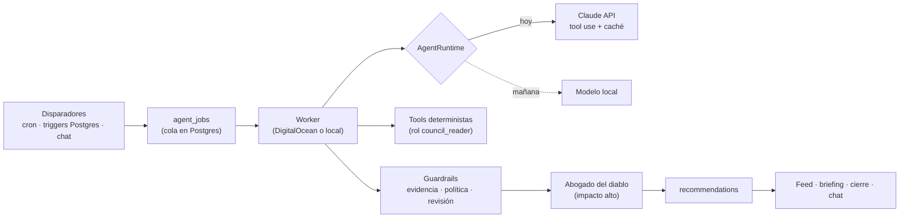

# GNERAI OS · Consejo de agentes — diseño

> **Estado: propuesta para validar.** Es el paso 1 del segundo prompt ("`AGENTS.md` con el diseño
> y espera mi OK"). Se llama `CONSEJO.md` porque `AGENTS.md` ya existe en el repo: son las
> instrucciones que leen los asistentes de código (Next.js 16), y mezclarlos confundiría a ambos.
> No se implementa nada de esto hasta vuestro OK.

## 0. Resumen

Un módulo de GNERAI OS con agentes de IA especializados (CFO, comercial, pricing, retención,
operaciones, crecimiento, fiscal, abogado del diablo y Chief of Staff) que **leen** el negocio a
través de herramientas deterministas y **proponen** decisiones con evidencia. No calculan de
cabeza, no ejecutan nada y no inventan datos. La política (cuánto guardar, cuándo repartir) la
fijáis vosotros; los agentes la aplican.

Tres decisiones de diseño que conviene validar ya:

1. **El modelo es intercambiable.** Hoy, Claude por API (tool use). Mañana, un modelo local. Las
   herramientas, los esquemas de salida, los guardrails y los evals no dependen del proveedor:
   solo cambia el adaptador `AgentRuntime` (§5).
2. **Sin datos de caja y gastos no hay CFO.** Hoy GNERAI OS sabe todo del lado de los ingresos
   (contratos, facturas, cobros, pipeline). Para "cuánto podéis repartir" faltan tres cosas de la
   fase 2: gastos, saldo de caja y retribución de socios. Propongo adelantarlas (§3).
3. **Silencio útil por diseño.** Un umbral de impacto (p. ej. 300 €) y un revisor (el abogado del
   diablo) filtran antes de publicar. Menos recomendaciones y mejores.

## 1. Principios (no negociables)

| Principio | Cómo se garantiza |
|---|---|
| El LLM no calcula | Toda cifra sale de una tool (SQL/TS testeado). **Guardrail de salida:** cada número del texto tiene que aparecer en `evidence`; si no, se rechaza y se regenera (máx. 2 veces) |
| Solo lectura | Las tools usan un rol de Postgres `council_reader` con `SELECT` sobre vistas concretas y RLS por org. No existe ninguna tool que escriba. Aceptar una recomendación crea tareas; nunca mueve dinero |
| Evidencia siempre | `evidence[]` obligatoria (métrica, valor, periodo, tool, enlace a la pantalla). Sin datos → la recomendación dice qué falta, no inventa |
| La política la ponen los socios | `financial_policy` versionada; cada recomendación guarda `policy_version` |
| Fiscal, laboral y legal | `requires_professional_review = true` y etiqueta "Validar con gestoría". Nunca se presenta como asesoramiento |
| Silencio útil | Umbral de impacto configurable + deduplicación contra recomendaciones abiertas o descartadas |
| Coste controlado | Presupuesto mensual por agente, caché de contexto, log de coste por ejecución |

## 2. Dónde vive en el repo

El prompt pide `lib/agent-tools/` y `agents/<nombre>/`. En este repo todo cuelga de `src/`:

```
src/council/
├─ tools/                 # herramientas deterministas (TS puro + SQL), con tests sobre el seed
│  ├─ revenue.ts          # get_revenue, get_mrr_history, get_churn, get_nrr
│  ├─ cash.ts             # get_cash_position, get_cash_forecast, get_runway
│  ├─ tax.ts              # get_tax_provisions (IVA repercutido − soportado, IS estimado)
│  ├─ clients.ts          # get_client_profitability, get_at_risk_clients, get_upsell_candidates
│  ├─ pipeline.ts         # get_pipeline, get_stalled_deals, get_conversion_by_source
│  ├─ capacity.ts         # get_capacity (horas GTiQ, fase 2)
│  ├─ seo.ts              # get_seo_summary (módulo SEO, ya en marcha)
│  ├─ policy.ts           # get_policy, get_past_recommendations
│  ├─ simulate.ts         # simulate(scenario): caja, margen y runway a 3/6/12 meses
│  └─ registry.ts         # nombre, descripción, esquema Zod de entrada/salida → definición de tool
├─ agents/<nombre>/       # prompt.md, tools permitidas, disparadores, esquema de salida, tests
├─ agents.config.ts       # modelo, presupuesto y umbrales por agente
├─ runtime/               # AgentRuntime: claude.ts (hoy), local.ts (mañana)
├─ guardrails/            # números-en-evidencia, política, revisión profesional
└─ evals/                 # ≥ 15 escenarios con la recomendación esperada + script de puntuación
```

Las tools **reutilizan el dominio que ya existe**: `src/domain/metrics` (MRR, movimientos),
`src/domain/billing` (calendario de facturación: previsión exacta de ingresos recurrentes),
`src/domain/tax` (IVA/IRPF) y las vistas de facturación (`invoices_overview`, `clients_overview`).
La previsión de caja no se estima: los cobros recurrentes futuros salen del mismo motor que
factura (`periodsDue` hacia delante).

## 3. Datos: lo que hay y lo que falta

| Dato | Estado | Para qué agente |
|---|---|---|
| Ingresos recurrente / uso / one-off, MRR, churn, NRR | **Listo** (hitos 1.2 y 1.4) | CFO, pricing, retención, Chief of Staff |
| Cobros, vencidas, días de cobro | **Listo** | CFO, retención |
| Pipeline ponderado, conversión por fuente, deals parados | **Listo** (hito 1.1) | Comercial, crecimiento |
| Renovaciones, clientes en riesgo (vencidas, sin actividad) | **Listo** | Retención |
| SEO (Search Console, GA4) | **En marcha**, falta conectar Google | Crecimiento |
| **Gastos y suscripciones** (`expenses`, `expense_subscriptions`) | Falta (fase 2) | CFO, pricing, fiscal (IVA soportado) |
| **Saldo de caja** (`cash_accounts`, `cash_balances`) | Falta | CFO (runway, reparto) |
| **Retribución de socios** (`partner_compensation`, `shareholdings`) | Falta (fase 2) | CFO |
| Horas por cliente y socio (GTiQ → `time_entries`) | Falta (fase 2) | Pricing (€/hora), operaciones |

**Propuesta:** antes del agente CFO, un mini-hito "Control 0" con gastos (alta manual + import
CSV del banco), saldo de caja (manual al principio; luego agregador PSD2, p. ej. GoCardless Bank
Account Data, gratuito para bancos europeos) y retribución de socios. Sin eso, el CFO solo podría
hablar de ingresos, que es justo lo que ya enseña el dashboard.

## 4. Política financiera

Tabla `financial_policy` (una vigente por org) + `policy_versions` (histórico inmutable). Se edita
en **Ajustes → Política financiera**. Los valores por defecto son **solo de ejemplo**:

| Campo | Ejemplo | Uso |
|---|---|---|
| Colchón objetivo | 4 meses de gastos fijos | CFO: reparto y alertas de runway |
| Provisión de Impuesto de Sociedades | 25 % del beneficio | CFO y fiscal |
| Reparto del beneficio disponible | impuestos → colchón → 30 % reinversión → 70 % socios | Cierre mensual |
| Subir retribución de socios | 3 meses seguidos con MRR > X, colchón cumplido, margen ≥ Y % | CFO |
| Contratar | capacidad comprometida > 85 % durante 6 semanas y pipeline ponderado ≥ Z €/mes | Operaciones |
| Margen mínimo por proyecto / €/hora objetivo | 40 % / 60 €/h | Pricing |
| Umbral de impacto para avisar | 300 € | Todos |
| Umbral "impacto alto" (revisión del abogado del diablo) | 2.000 € | Todos |

## 5. Ejecución



- **Cola:** `agent_jobs` (agente, disparador, payload, estado, intentos). La llenan el cron diario
  (lunes 8:00 briefing, día 5 cierre mensual), triggers de Postgres (cobro grande, gasto recurrente
  nuevo, deal perdido, factura vencida…) y el chat.
- **Worker:** proceso aparte (DigitalOcean worker hoy, un Mac o servidor local mañana). Nunca
  dentro de una petición web.
- **Modelos (en `agents.config.ts`):** `claude-sonnet-5` para lo diario; `claude-opus-5-5` para el
  cierre mensual, el abogado del diablo y el Chief of Staff. Salida JSON validada con Zod; si no
  valida, se reintenta.
- **Modelo local ("luego irán en local"):** el `AgentRuntime` local habla con un servidor
  compatible (llama.cpp/Ollama/vLLM). Los evals deciden si un modelo local da la talla por agente:
  se puede empezar con los agentes baratos en local y el cierre mensual en la API.
- **Coste:** presupuesto mensual por agente (`agent_budgets`); si se agota, el agente se pausa y
  avisa. Caché del contexto base (qué es GNERAI, servicios, socios, política). Todo en `agent_runs`:
  entrada, tools llamadas, salida, tokens, coste y duración.

## 6. Agentes

| Agente | Misión | Disparadores | Tools principales |
|---|---|---|---|
| **CFO · Tesorería y reparto** | Cuánto guardar, repartir y reinvertir; provisión de impuestos; cuándo subir retribución; alertas de caja | Cierre mensual (día 5), cobro grande, gasto recurrente nuevo, runway < política | cash, forecast, runway, tax, revenue, policy, simulate |
| **Director comercial** | Deals parados, siguiente mejor acción, previsión de cierre, fuentes que convierten | Diario; deal sin movimiento X días; deal perdido | pipeline, stalled_deals, conversion_by_source |
| **Pricing y margen** | Clientes y servicios poco rentables; cuándo y cuánto subir; qué paquetizar | Mensual; proyecto cerrado con margen < política | client/service_profitability, revenue, simulate |
| **Retención y upsell** | Riesgo, renovaciones, venta cruzada | Semanal; factura vencida; renovación a 60 días | at_risk_clients, renewals, upsell_candidates |
| **Operaciones y capacidad** | Carga por socio, cuellos de botella, contratar o externalizar | Semanal; deal grande ganado | capacity, pipeline, policy |
| **Crecimiento y SEO** | Qué canal trae clientes que pagan; dónde invertir en marketing propio | Mensual | seo_summary, conversion_by_source, revenue |
| **Fiscal y cumplimiento** | Calendario de IVA, IS, retenciones y Verifactu; cuantifica y avisa con antelación | Calendario fiscal; cierre trimestral | tax, cash, policy · **siempre revisión profesional** |
| **Abogado del diablo** | Revisa las de impacto alto: supuestos débiles, riesgos, escenario pesimista | Antes de publicar lo que supera el umbral alto | las mismas tools que el agente revisado |
| **Chief of Staff** | No analiza los datos en bruto sino lo que ven los otros 8: convierte sus recomendaciones abiertas en el plan de acción del lunes (las 3 acciones críticas antes del martes, alertas de riesgo, oportunidades de optimización y conflictos resueltos), cada punto con su impacto en € (una métrica) y su urgencia/riesgo; media en los conflictos (comercial vs pricing, CFO vs crecimiento) con una solución equilibrada | Lunes 8:00 (briefing); cierre mensual; bajo demanda | recomendaciones abiertas + todas las tools (solo lectura, para comprobar cifras, la caja y el semáforo) |

Upsell con los datos de GNERAI: web sin mantenimiento ni SEO, Ads sin landing, SEO sin informe
mensual, clientes con un solo servicio desde hace más de 6 meses… Las reglas son datos (tabla
`upsell_rules`), no código.

## 7. Recomendación (tabla `recommendations`)

El formato del prompt, tal cual, con tres añadidos: `org_id`, `run_id` (de `agent_runs`) y
`dedupe_key` (para no repetir lo que sigue abierto o se descartó hace poco). Estados: nueva,
aceptada, descartada, pospuesta, hecha. Aceptar crea tareas; descartar pide el motivo en una
línea y ese motivo vuelve al contexto del agente la próxima vez ("descartasteis subir precios a
hostelería porque…").

**Aprendizaje:** a los 30, 60 y 90 días de una aceptada, el agente compara el impacto real con el
estimado (mismas tools) y lo guarda en `recommendation_reviews`. La pantalla enseña el "acierto
de previsiones" por agente.

## 8. Interfaz

- **Feed:** tarjetas con título accionable, impacto en €, confianza y urgencia. Aceptar /
  descartar (motivo) / posponer. "Ver cálculo" despliega la evidencia con enlaces a las pantallas.
- **Briefing semanal:** informe de 3-5 decisiones, caja y runway, semáforo por área. También por
  email a los socios (Resend), siempre con enlace a la app.
- **Cierre mensual:** propuesta de reparto (impuestos → colchón → reinversión → socios), editable.
  Al aceptarla queda registrada con la versión de la política.
- **Chat con el consejo:** preguntas libres; el Chief of Staff enruta, responde con cifras y
  fuentes, y en streaming.
- **Simulador:** sliders (precios, contratación, retribución, pérdida de un cliente) con la caja
  a 12 meses. Es la tool `simulate` con interfaz: el mismo cálculo que usan los agentes.
- **Ajustes:** política, agentes activos, modelo por agente, umbrales, presupuesto y log.

## 9. Calidad

- **Tools:** tests con escenarios del seed: meses con pérdidas, un cliente grande que se va, un
  trimestre con IVA alto. La demo ya incluye un cliente dado de baja, una pausa, una subida de
  precio, impagados y un traspaso de emisor.
- **Evals:** ≥ 15 escenarios en `src/council/evals/` con la recomendación esperada. El script
  puntúa: ¿usó tools en vez de inventar cifras?, ¿respetó la política?, ¿marcó revisión
  profesional cuando tocaba?, ¿se calló cuando no había nada? Se ejecuta en CI con respuestas
  grabadas y bajo demanda contra el modelo real.
- **Guardrails:** números-en-evidencia, coherencia con la política, marcado fiscal/laboral.

## 10. Orden de trabajo propuesto

1. Este documento → vuestro OK.
2. "Control 0": gastos, saldo de caja y retribución de socios (sin esto no hay CFO útil).
3. Capa de tools + tests (sobre la demo).
4. Política financiera + Ajustes.
5. Agente CFO + cierre mensual (el que más valor da primero).
6. Chief of Staff + briefing semanal.
7. Resto de agentes, uno a uno, cada uno con sus evals.
8. Chat, simulador y aprendizaje.

## 11. Lo que necesito de vosotros para empezar

1. **OK a este diseño** (o cambios), sobre todo al "Control 0" antes del CFO.
2. **Política financiera inicial:** colchón en meses, reparto, reglas de subida de retribución y
   de contratación. Si no, arranco con los ejemplos marcados como tales.
3. **Caja:** ¿qué bancos usáis? ¿Empezamos con saldo manual o conectamos un agregador PSD2?
4. **Gastos:** ¿dónde están hoy (Excel, banco, gnerai-finance)? ¿Hay import posible?
5. **Modelo local:** ¿qué máquina tenéis pensada (memoria/GPU)? Define qué modelos caben.
6. **Presupuesto de API** mensual aproximado para la fase con Claude.
